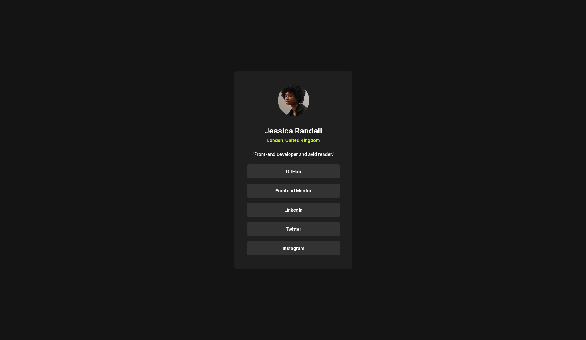
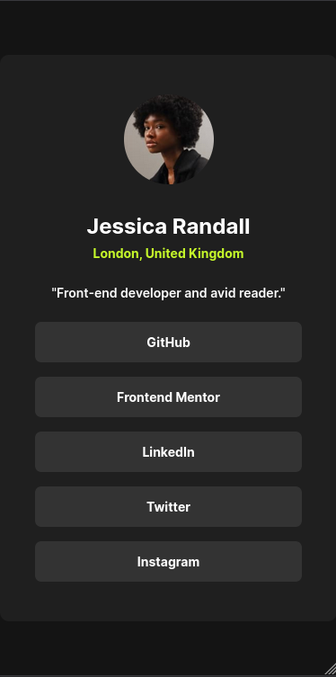

# Frontend Mentor - Social links profile solution

This is a solution to the [Social links profile challenge on Frontend Mentor](https://www.frontendmentor.io/challenges/social-links-profile-UG32l9m6dQ). Frontend Mentor challenges help you improve your coding skills by building realistic projects.

## Table of contents

- [Overview](#overview)
  - [The challenge](#the-challenge)
  - [Screenshot](#screenshot)
  - [Links](#links)
- [My process](#my-process)
  - [Built with](#built-with)
  - [Continued development](#continued-development)
- [Author](#author)

## Overview

### The challenge

Users should be able to:

- See hover and focus states for all interactive elements on the page

### Screenshot

### Links

- Solution URL: [https://github.com/akil4/social-links-profile](https://github.com/akil4/social-links-profile)
- Live Site URL: [https://akil4.github.io/social-links-profile](https://akil4.github.io/social-links-profile/)

## My process

### Built with

- Semantic HTML5 markup
- CSS custom properties
- Flexbox
- Mobile-first workflow

### Continued development

I would like to use this for my personal social links profile maybe in my portfolio website. I would like to add more links and make it more interactive.

## Author

- Website - [Akil S](https://akil4.vercel.app)
- Frontend Mentor - [@akil4](https://www.frontendmentor.io/profile/akil4)
- LinkedIn - [@akil4](https://www.linkedin.com/in/akil4/)